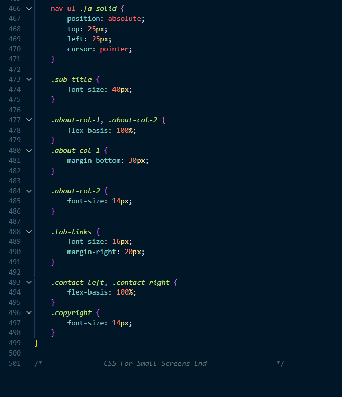
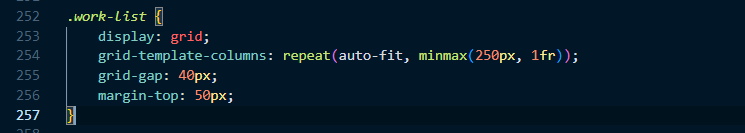

# TheAmazingPortfolio

The Amazing Portfolio - Readme
The Amazing Portfolio is a personal portfolio website designed to showcase the skills, experience, and projects of Mika Korkiakoski, an IT student from Finland. This readme provides an overview of the structure and functionality of the website.

## Table of Contents
- [TheAmazingPortfolio](#theamazingportfolio)
  - [Table of Contents](#table-of-contents)
  - [Sections](#sections)
  - [About](#about)
  - [Services](#services)
  - [Contact](#contact)
  - [Navigation](#navigation)
  - [Tabs](#tabs)
  - [Credits](#credits)
  - [For review Examples](#for-review-examples)
    - [HTML](#html)
    - [1/5 Basic HTML structure is present.](#15-basic-html-structure-is-present)
    - [2/5 HTML structure with clear content differentiation (headings, paragraphs, lists).](#25-html-structure-with-clear-content-differentiation-headings-paragraphs-lists)
    - [3/5 Use of forms, links, and media.](#35-use-of-forms-links-and-media)
    - [4/5 Tables are effectively used.](#45-tables-are-effectively-used)
    - [5/5 Consistent use of semantic HTML throughout, ensuring better structure and understanding of the content.](#55-consistent-use-of-semantic-html-throughout-ensuring-better-structure-and-understanding-of-the-content)
    - [CSS](#css)
    - [1/5 Basic CSS styling (colors, fonts).](#15-basic-css-styling-colors-fonts)
    - [2/5 Use of classes and IDs to style specific elements.](#25-use-of-classes-and-ids-to-style-specific-elements)
    - [3/5 Implementation of responsive design elements.](#35-implementation-of-responsive-design-elements)
    - [4/5 Use of layouts for advanced user interfaces (arrays, float, flexbox, css grid)](#45-use-of-layouts-for-advanced-user-interfaces-arrays-float-flexbox-css-grid)
    - [5/5 Styling demonstrates a strong grasp of layout principles, aesthetics, and user experience.](#55-styling-demonstrates-a-strong-grasp-of-layout-principles-aesthetics-and-user-experience)
    - [Javascript Basics](#javascript-basics)
    - [1/5 Simple interactions (like alerts on button click).](#15-simple-interactions-like-alerts-on-button-click)
    - [2/5 Multiple event listeners and basic DOM manipulations.](#25-multiple-event-listeners-and-basic-dom-manipulations)
    - [3/5 Use of arrays, objects, and functions.](#35-use-of-arrays-objects-and-functions)
    - [4/5 Advanced logic, looping through data, and dynamic DOM updates.](#45-advanced-logic-looping-through-data-and-dynamic-dom-updates)
    - [5/5 Consistent use of Object-Oriented JavaScript principles.](#55-consistent-use-of-object-oriented-javascript-principles)
    - [Asynchronous Operations](#asynchronous-operations)
    - [1/5 Use of timers.](#15-use-of-timers)
    - [2/5 Successful implementation of an AJAX call or Fetch.](#25-successful-implementation-of-an-ajax-call-or-fetch)
    - [3/5 Data from the asynchronous call is displayed on the webpage.](#35-data-from-the-asynchronous-call-is-displayed-on-the-webpage)
    - [4/5 Error handling is implemented (for failed API calls, etc.).](#45-error-handling-is-implemented-for-failed-api-calls-etc)
    - [5/5 Effective use of asynchronous data to enhance user experience (like filtering, sorting).](#55-effective-use-of-asynchronous-data-to-enhance-user-experience-like-filtering-sorting)
## Sections
Header contains the website logo and navigation menu.
Displays an animated introduction with the name "Mika Korkiakoski" and "Finland."

## About
Provides information about Mika's background and skills.
Features tabs to switch between sections about "Skills," "Experience," and "Education."

## Services
Highlights the services offered by Mika, including "Web Design," "UI/UX Design," and "Device-Oriented Programming."
My Works
Showcases Mika's projects with images, descriptions, and links to GitHub repositories.
Includes a "See more" button that links to Mika's GitHub profile.

## Contact
Provides contact information, including email and phone number.
Offers links to Mika's social media profiles.
Includes a downloadable CV.
Features a contact form for sending messages.

## Navigation
The navigation menu allows users to jump to different sections of the website by clicking on menu items.
A "hamburger" menu icon (three horizontal lines) opens the menu on small screens.

## Tabs

In the "About" section, users can switch between "Skills," "Experience," and "Education" tabs to view specific information.
Projects
The "My Works" section displays three projects with descriptions and links to GitHub.
Users can click on the links to view project details on GitHub.
Contact Form
The contact form in the "Contact" section allows users to enter their name, email, and a message.
Clicking the "Submit" button sends the message (functionality may require server-side scripting).
Scroll to Top
A "Scroll to Top" button appears at the bottom right of the page, allowing users to quickly return to the top of the website.

## Credits

The website uses the Font Awesome icon library for icons.
It includes the Typed.js library for the animated text in the header.
External CSS and JavaScript files are linked for styling and interactivity.
The website is authored by Mika Korkiakoski.

## For review Examples

### HTML

### 1/5 Basic HTML structure is present.

### 2/5 HTML structure with clear content differentiation (headings, paragraphs, lists).

### 3/5 Use of forms, links, and media.

Forms and links are being used, i didn't need any media for my page but i added sound for successful message submit afterwards:

### 4/5 Tables are effectively used.

I don't have any tabular data yet.

### 5/5 Consistent use of semantic HTML throughout, ensuring better structure and understanding of the content. 
For example i use header and nav:

### CSS

### 1/5 Basic CSS styling (colors, fonts).
 Here's an example:

### 2/5 Use of classes and IDs to style specific elements. 
Example here:

### 3/5 Implementation of responsive design elements.
 You can check this with your mobile device when you go to my page. At least it works really well with Iphone 11.

### 4/5 Use of layouts for advanced user interfaces (arrays, float, flexbox, css grid)

In my works section i use grid, in services section i use grid, in about section i use flex and in navigation section i use flex.
My works section for example:

### 5/5 Styling demonstrates a strong grasp of layout principles, aesthetics, and user experience.
Yes my portfolio page is very nice when looking with computer and also with mobile-device:

### Javascript Basics

### 1/5 Simple interactions (like alerts on button click).
 For example here i have scroll up button and about me toggle section:

### 2/5 Multiple event listeners and basic DOM manipulations.
Here are 3 event listeners and if you just open app.js you can see every function is basically DOM manipulation.

### 3/5 Use of arrays, objects, and functions.
In the function opentab, tablinks and tabcontents are arrays of elements selected by their class names.

In the typing animation there is object called 'Typed'

Previous screenshots should have revealed that there are multiple functions in app.js. You can also check the file if you wish.

### 4/5 Advanced logic, looping through data, and dynamic DOM updates.
There is advanced logic and dynamic DOM updates in typing animation for example.

Also there is DOM update in 'Scroll to Top' button because it's visibility is dynamically
toggled based on the user's scroll position.

I also loop through data in 'opentab' function to loop through all elements with the 
class 'tablinks' using the 'for...'of' loop, represented by 'tablink'.

### 5/5 Consistent use of Object-Oriented JavaScript principles.
As i said i use 'Typed' object as a constructor. Another instances of object-oriented programming principles that are being used are var tablinks and var tabcontents that are using HTMLCollection to return elements with the specified class name. Also there is HTMLDivElement objects being used when i want to access and modify the styles and properties of DOM elements, such as
ScrollToTopButton.style.display = "block";

### Asynchronous Operations

### 1/5 Use of timers.
 I use timers when i want to reset message sending form and wipe the message after 5 seconds that is being displayed if message is successfully sended or not.

### 2/5 Successful implementation of an AJAX call or Fetch.
 From the latest image you can see that there is a successful implementation of Fetch.

### 3/5 Data from the asynchronous call is displayed on the webpage.
While the data fetched is not directly displayed on the webpage, the user receives feedback on the form submission result.

### 4/5 Error handling is implemented (for failed API calls, etc.).
 Error handlings are implemented in message form submission.

### 5/5 Effective use of asynchronous data to enhance user experience (like filtering, sorting).

no.

